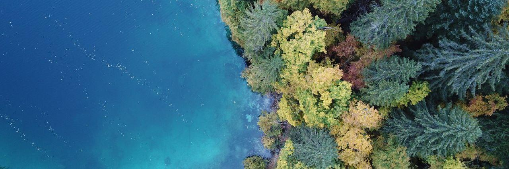

|  | 
|:--:| 
| *Tovel Lake - Trentino - Italy.  Drone shot by me* |

## Hi all! I am Davide Bressan  

Trained as computer scientist and bioinformatician, I am now working as a computational biologist in the stem cells and cancer genomics laboratory at the University of Trento (PhD student). 

🔭 I’m working on the epigenetics of liver regeneration and tumorigenesis. 

🌱 I’m currently learning scRNA-seq, scATAC-seq

#### Contact 📫
[Lab website](https://www.cibio.unitn.it/956/laboratory-of-stem-cells-and-cancer-genomics) and 

 &nbsp;&nbsp;&nbsp;&nbsp; 
 &nbsp;&nbsp;&nbsp;&nbsp;  

&nbsp;

